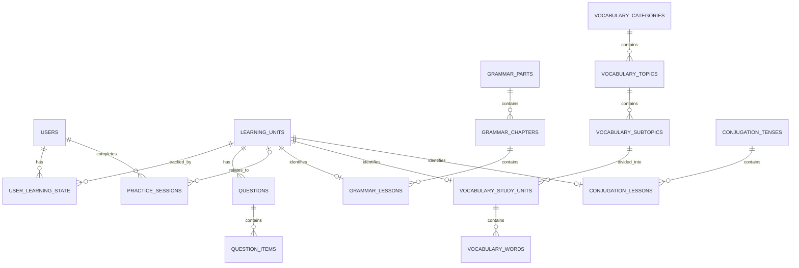

# French Learning Web Application
## Database Design Specification

**Document status:** Baseline v1.0  
**Project type:** Web Application Development final project  
**Database:** SQLite  

---

## 1. Purpose

This document defines the database design for the French Learning Web Application MVP.

It is intended to be used as a shared implementation reference by all team members, including AI-assisted coding workflows. Database-related code should follow this document unless the team explicitly approves a design change.

The design supports:

- learner accounts and support-language preference;
- Grammar, Vocabulary, and Verb Conjugation learning content;
- three practice question types;
- explicit completion tracking;
- Review Later state;
- Continue Learning state;
- current and longest learning streaks;
- Basic Practice History summaries for completed Practice and Mixed Practice sessions;
- Mixed Practice based on previously learned content, with optional filtering by module and question type;
- a lightweight French Alphabet & Accents reference;
- optional Learning Activity Calendar data derived from completed practice activity;
- optional IPA transcription for Vocabulary entries;
- static learning content loaded from version-controlled source files.

The database is intentionally designed for a local SQLite MVP and avoids infrastructure that is unnecessary for the current project scope.

---

## 2. Design Principles

### 2.1 Separate content structure from learner state

Static curriculum data and learner-generated state serve different purposes and should remain conceptually separate.

**Static content** includes:

- Grammar hierarchy and lesson content;
- Vocabulary hierarchy and entries;
- Conjugation hierarchy and lesson content;
- Practice questions and question items;
- French Alphabet & Accents reference content.

**Learner state** includes:

- account information;
- selected support language;
- learned/completion state;
- Review Later state;
- most recently opened learning units;
- completed-practice summaries used by Basic Practice History, streak calculations, and the optional Learning Activity Calendar.

Static content is prepared in source files and seeded into SQLite. Learner state is created and updated by the running application.

### 2.2 Keep module-specific content separate

Grammar, Vocabulary, and Conjugation have different natural structures. They therefore use dedicated tables rather than being forced into one large generic content table.

A shared `learning_units` table is used only for concepts that are common across all three modules, such as:

- completion;
- practice questions;
- Review Later;
- Continue Learning;
- Mixed Practice.

Review Later and Continue Learning are core MVP behaviors, so their state must be implemented consistently through the shared learner/unit model rather than as module-specific shortcuts.

### 2.3 Database IDs are not display order

Primary keys identify records. They must not be used to determine curriculum order.

Ordered content uses a dedicated `sort_order` field.

### 2.4 Preserve the source-book hierarchy without forcing the learning UX to copy it exactly

The selected Grammar and Vocabulary books provide the curriculum hierarchy, but the web application may divide content into smaller learning units where necessary for usability.

This is especially important for Vocabulary, where book subtopics may contain very different numbers of vocabulary entries.

---

## 3. Key Concepts

### 3.1 `learning_units`

A **learning unit** is the smallest piece of content that the learner can treat as a complete learning item in the application.

A learning unit can be:

- one Grammar lesson;
- one Vocabulary Study Unit;
- one Conjugation rule/pattern lesson.

It is **not** the full content record itself. It acts as a shared identity that allows common features to reference all three modules consistently.

Example:

```text
learning_unit #17  -> Grammar: Les articles definis
learning_unit #42  -> Vocabulary: Les metiers - Partie 1
learning_unit #81  -> Conjugation: Present - regular -ER verbs
```

This allows shared tables to use one reference:

```text
questions.learning_unit_id
user_learning_state.learning_unit_id
```

instead of implementing separate Grammar, Vocabulary, and Conjugation progress systems.

### 3.2 `sort_order`

`sort_order` controls the intended display sequence **within the same parent**.

It is separate from the record `id` because IDs are database identities, not curriculum positions.

Use gaps from the beginning:

```text
10
20
30
40
```

This makes later insertion easier:

```text
10  Lesson A
15  New Lesson
20  Lesson B
30  Lesson C
```

The same `sort_order` value may appear under different parents. For example, two different chapters may both have a first lesson with `sort_order = 10`.

### 3.3 `slug`

A `slug` is a stable, human-readable identifier such as:

```text
articles-definis
present-regular-er
metiers-professions-1
alimentation-1
```

Database numeric IDs may change when a local database is recreated. Slugs should remain stable and are therefore suitable for:

- content source references;
- API parameters where appropriate;
- question-to-learning-unit references during seeding;
- readable URLs.

All `learning_units.slug` values must be unique. `vocabulary_topics.slug` must also be unique within `vocabulary_topics` so Topic pages can use stable API parameters and readable URLs.

### 3.4 Reference content is not a learning unit

The French Alphabet & Accents page is foundational reference content, not a fourth learning module. It is stored separately from `learning_units` because it does not participate in completion, Review Later, Continue Learning, module progress, or lesson-specific practice.

This separation prevents contributors from accidentally treating reference-only content as a progress unit.

---

## 4. High-Level ERD



Subtype rule:

- each `learning_units` record must correspond to exactly one module-specific learning-unit record consistent with its `unit_type`;
- `unit_type = grammar` -> one related `grammar_lessons` record;
- `unit_type = vocabulary` -> one related `vocabulary_study_units` record;
- `unit_type = conjugation` -> one related `conjugation_lessons` record;
- a learning unit must not belong to more than one module-specific subtype.

The ERD therefore shows each individual module-specific relationship as optional (`0..1`) from the `learning_units` side, while the application-level invariant requires exactly one subtype overall. This cross-table invariant must be enforced by seed validation and backend logic.

`practice_sessions.learning_unit_id` is optional because normal Practice references one learning unit, while Mixed Practice does not belong to a single learning unit.

`reference_pages` is intentionally standalone static content and therefore has no learner-state relationship in the ERD.

---

## 5. Table Summary

| Table | Purpose |
|---|---|
| `users` | Learner account and support-language preference |
| `learning_units` | Shared identity for all completable/practiceable learning units |
| `grammar_parts` | Top-level Grammar sections |
| `grammar_chapters` | Grammar chapters within a part |
| `grammar_lessons` | Individual Grammar learning lessons |
| `vocabulary_categories` | Top-level Vocabulary categories |
| `vocabulary_topics` | Numbered Vocabulary topics within a category |
| `vocabulary_subtopics` | Book-defined Vocabulary subtopics |
| `vocabulary_study_units` | App-defined learning chunks generated from subtopics |
| `vocabulary_words` | Individual vocabulary entries |
| `conjugation_tenses` | Conjugation tense groups |
| `conjugation_lessons` | Rule/pattern-based Conjugation lessons |
| `questions` | Practice questions linked to learning units |
| `question_items` | MCQ choices, accepted fill answers, or ordering pieces |
| `reference_pages` | Lightweight non-progress reference content such as French Alphabet & Accents |
| `user_learning_state` | Learned, Review Later, and last-opened state per user/unit |
| `practice_sessions` | One summary row per completed normal Practice or Mixed Practice session; source for Practice History, streaks, and optional activity-calendar data |

---

## 6. Table Specifications

## 6.1 `users`

One row represents one learner account.

| Column | Type | Constraints / Meaning |
|---|---|---|
| `id` | INTEGER | Primary key |
| `email` | TEXT | Required, unique; stored in trimmed lowercase normalized form |
| `password_hash` | TEXT | Required; never store plain-text passwords |
| `support_language` | TEXT | Nullable until first-time setup; allowed values: `vi`, `en` |
| `created_at` | TEXT / DATETIME | Required creation timestamp |

Notes:

- A separate profile table is not required for the MVP.
- `email` is normalized by the backend before insert/lookup by trimming surrounding whitespace and converting to lowercase; the database therefore stores the normalized value used for uniqueness.
- `support_language` is stored with the account so it persists across future logins. When it is `NULL`, language-sensitive API responses use Vietnamese as a temporary fallback without persisting that fallback value.

---

## 6.2 `learning_units`

Provides the common identity for all content that can be marked as learned and used for practice.

| Column | Type | Constraints / Meaning |
|---|---|---|
| `id` | INTEGER | Primary key |
| `unit_type` | TEXT | Required; `grammar`, `vocabulary`, or `conjugation` |
| `slug` | TEXT | Required, unique, stable identifier |
| `title_fr` | TEXT | Required primary French title |
| `title_vi` | TEXT | Optional support-language title |
| `title_en` | TEXT | Optional support-language title |

Notes:

- `title_vi` and `title_en` are optional because some learning items may intentionally retain the French title and use support-language explanations instead.
- Module-specific fields must not be added here. They belong in the corresponding module table.
- Each `learning_units` record must be backed by exactly one module-specific record matching `unit_type`; seed validation and backend logic must enforce this cross-table invariant.

## 6.3 `reference_pages`

Stores lightweight reference-only learning content that does not participate in progress tracking. The MVP uses this table for the French Alphabet & Accents reference.

| Column | Type | Constraints / Meaning |
|---|---|---|
| `id` | INTEGER | Primary key |
| `slug` | TEXT | Required, unique, stable identifier |
| `title_fr` | TEXT | Required primary French title |
| `title_vi` | TEXT | Optional Vietnamese support-language title |
| `title_en` | TEXT | Optional English support-language title |
| `content_vi` | TEXT | Required Markdown content for Vietnamese support |
| `content_en` | TEXT | Required Markdown content for English support |
| `sort_order` | INTEGER | Required; display order if multiple reference pages exist |

Important rule:

- `reference_pages` records must **not** be inserted into `learning_units`;
- opening a reference page does not create completion, Review Later, Continue Learning, practice, or streak state.

---

# 7. Grammar Schema

The Grammar source book follows a hierarchy equivalent to:

```text
Part
-> Chapter
-> Lesson / subsection
```

The application preserves this hierarchy.

## 7.1 `grammar_parts`

| Column | Type | Constraints / Meaning |
|---|---|---|
| `id` | INTEGER | Primary key |
| `title_fr` | TEXT | Required |
| `title_vi` | TEXT | Optional |
| `title_en` | TEXT | Optional |
| `sort_order` | INTEGER | Required; positive; normally 10, 20, 30... |

## 7.2 `grammar_chapters`

| Column | Type | Constraints / Meaning |
|---|---|---|
| `id` | INTEGER | Primary key |
| `part_id` | INTEGER | Required FK -> `grammar_parts.id` |
| `title_fr` | TEXT | Required |
| `title_vi` | TEXT | Optional |
| `title_en` | TEXT | Optional |
| `sort_order` | INTEGER | Required; order within the parent part |

Recommended uniqueness rule:

```text
(part_id, sort_order)
```

## 7.3 `grammar_lessons`

One row represents one Grammar progress unit.

| Column | Type | Constraints / Meaning |
|---|---|---|
| `learning_unit_id` | INTEGER | Primary key and FK -> `learning_units.id` |
| `chapter_id` | INTEGER | Required FK -> `grammar_chapters.id` |
| `sort_order` | INTEGER | Required; order within the chapter |
| `content_vi` | TEXT | Required Markdown content for Vietnamese support |
| `content_en` | TEXT | Required Markdown content for English support |

Recommended uniqueness rule:

```text
(chapter_id, sort_order)
```

---

# 8. Vocabulary Schema

The Vocabulary book provides a hierarchy equivalent to:

```text
Category
-> Topic
-> Subtopic
```

The application adds a fourth level:

```text
Study Unit
```

A **Subtopic** preserves the source-book organization. A **Study Unit** is the smaller learning chunk presented to the learner.

This distinction prevents a large book subtopic from becoming an excessively long learning session.

## 8.1 `vocabulary_categories`

| Column | Type | Constraints / Meaning |
|---|---|---|
| `id` | INTEGER | Primary key |
| `title_fr` | TEXT | Required |
| `title_vi` | TEXT | Optional |
| `title_en` | TEXT | Optional |
| `sort_order` | INTEGER | Required |

## 8.2 `vocabulary_topics`

| Column | Type | Constraints / Meaning |
|---|---|---|
| `id` | INTEGER | Primary key |
| `category_id` | INTEGER | Required FK -> `vocabulary_categories.id` |
| `slug` | TEXT | Required, unique, stable identifier for Topic navigation/API |
| `title_fr` | TEXT | Required |
| `title_vi` | TEXT | Optional |
| `title_en` | TEXT | Optional |
| `sort_order` | INTEGER | Required; order within category |

Recommended uniqueness rules:

```text
UNIQUE(slug)
(category_id, sort_order)
```

The Topic slug is intended for stable Topic-page URLs and API parameters, for example `alimentation-1`. It must remain stable even if numeric IDs change after a local reseed.

The printed topic number from the book does not need its own database field unless the team later decides it must be displayed independently. `sort_order` already preserves sequence.

## 8.3 `vocabulary_subtopics`

One row represents one book-defined Vocabulary subtopic.

| Column | Type | Constraints / Meaning |
|---|---|---|
| `id` | INTEGER | Primary key |
| `topic_id` | INTEGER | Required FK -> `vocabulary_topics.id` |
| `title_fr` | TEXT | Required |
| `title_vi` | TEXT | Optional |
| `title_en` | TEXT | Optional |
| `sort_order` | INTEGER | Required; order within topic |

Recommended uniqueness rule:

```text
(topic_id, sort_order)
```

## 8.4 `vocabulary_study_units`

One row represents one Vocabulary progress unit presented by the application.

| Column | Type | Constraints / Meaning |
|---|---|---|
| `learning_unit_id` | INTEGER | Primary key and FK -> `learning_units.id` |
| `subtopic_id` | INTEGER | Required FK -> `vocabulary_subtopics.id` |
| `sort_order` | INTEGER | Required; order within subtopic |

Recommended uniqueness rule:

```text
(subtopic_id, sort_order)
```

The Study Unit title is stored in `learning_units`, not duplicated here.

## 8.5 `vocabulary_words`

One row represents one vocabulary entry or expression.

| Column | Type | Constraints / Meaning |
|---|---|---|
| `id` | INTEGER | Primary key |
| `study_unit_id` | INTEGER | Required FK -> `vocabulary_study_units.learning_unit_id` |
| `french` | TEXT | Required French word/expression |
| `meaning_vi` | TEXT | Required Vietnamese meaning |
| `meaning_en` | TEXT | Required English meaning |
| `ipa` | TEXT | Optional standard IPA transcription |
| `example_fr` | TEXT | Optional |
| `example_vi` | TEXT | Optional |
| `example_en` | TEXT | Optional |
| `sort_order` | INTEGER | Required; order within Study Unit |

A multi-word expression such as `avoir besoin de` counts as **one vocabulary entry**, not several words.

`ipa` is optional. When present, it stores standard IPA notation only; ad-hoc Vietnamese-style pronunciation spelling should not be stored in this field.

---

# 9. Verb Conjugation Schema

Conjugation content is organized by tense and rule/pattern rather than by one lesson per individual verb.

```text
Tense
-> Rule / Pattern Lesson
```

## 9.1 `conjugation_tenses`

| Column | Type | Constraints / Meaning |
|---|---|---|
| `id` | INTEGER | Primary key |
| `title_fr` | TEXT | Required |
| `title_vi` | TEXT | Optional |
| `title_en` | TEXT | Optional |
| `sort_order` | INTEGER | Required |

## 9.2 `conjugation_lessons`

One row represents one Conjugation progress unit.

| Column | Type | Constraints / Meaning |
|---|---|---|
| `learning_unit_id` | INTEGER | Primary key and FK -> `learning_units.id` |
| `tense_id` | INTEGER | Required FK -> `conjugation_tenses.id` |
| `sort_order` | INTEGER | Required; order within tense |
| `content_vi` | TEXT | Required Markdown explanation |
| `content_en` | TEXT | Required Markdown explanation |

Recommended uniqueness rule:

```text
(tense_id, sort_order)
```

A searchable individual verb reference is outside the core schema and should be designed separately only if the Should Have Verb Reference feature is implemented.

---

# 10. Practice Question Schema

All three required question types share one question table.

Supported `question_type` values:

```text
mcq
fill_blank
ordering
```

## 10.1 `questions`

| Column | Type | Constraints / Meaning |
|---|---|---|
| `id` | INTEGER | Primary key |
| `learning_unit_id` | INTEGER | Required FK -> `learning_units.id` |
| `question_type` | TEXT | Required; one of the supported types |
| `prompt_vi` | TEXT | Required |
| `prompt_en` | TEXT | Required |
| `explanation_vi` | TEXT | Optional feedback/explanation |
| `explanation_en` | TEXT | Optional feedback/explanation |
| `sort_order` | INTEGER | Required; normal-practice order within the learning unit |

Recommended uniqueness rule:

```text
(learning_unit_id, sort_order)
```

## 10.2 `question_items`

Stores the variable pieces used by the three question types.

| Column | Type | Constraints / Meaning |
|---|---|---|
| `id` | INTEGER | Primary key |
| `question_id` | INTEGER | Required FK -> `questions.id` |
| `item_text` | TEXT | Required |
| `is_correct` | INTEGER / BOOLEAN | Used for MCQ and accepted fill answers; nullable where not applicable |
| `correct_position` | INTEGER | Used for sentence ordering; nullable where not applicable |
| `sort_order` | INTEGER | Required stable source/display order |

### Column usage by `question_type`

Which of `is_correct` / `correct_position` applies depends on the parent `questions.question_type`, not on `question_items` alone:

| `question_type` | `is_correct` | `correct_position` |
|---|---|---|
| `mcq` | Required boolean; exactly one item per question has `is_correct = true` | Always `NULL` |
| `fill_blank` | Required boolean; one or more items may have `is_correct = true` (accepted answers) | Always `NULL` |
| `ordering` | Always `NULL` (no single item is individually "correct") | Required; unique per question, forming the contiguous sequence `1..N` |

This is a cross-table invariant, since it depends on a sibling table's column rather than anything expressible within `question_items` itself. It cannot be enforced by a SQLite `CHECK` constraint and must instead be enforced by seed validation before any row is written (see §16.3), and by backend service-layer validation if `question_items` is ever written outside the seed pipeline. A seeded `ordering` item with a non-null `is_correct`, or a seeded `mcq`/`fill_blank` item with a non-null `correct_position`, is a validation error and must stop the seed before writing.

### MCQ representation

```text
item_text   is_correct
le          true
la          false
un          false
une         false
```

MVP rule: each MCQ has exactly one correct option.

### Fill-in-the-Blank representation

Each accepted answer is stored as a question item marked correct.

```text
item_text   is_correct
suis        true
```

Multiple accepted answers may be stored when required.

Fill-in-the-Blank answer evaluation is a backend/business-logic concern rather than a separate storage structure. For the MVP, comparison should trim leading/trailing whitespace and ignore letter case. French spelling, accents, and apostrophes remain significant unless another form is explicitly stored as an accepted answer.

### Sentence Ordering representation

```text
item_text    correct_position
Je           1
parle        2
francais     3
```

The backend shall shuffle the pieces when generating the learner-facing question and must not use the canonical correct sequence as the initial learner-facing order. `correct_position` preserves the intended answer. For every ordering question, all `correct_position` values must be non-null, unique within that question, and form the contiguous sequence `1..N`, where `N` is the number of pieces.

---

# 11. Learner State Schema

## 11.1 `user_learning_state`

Represents the state of one learner relative to one learning unit.

| Column | Type | Constraints / Meaning |
|---|---|---|
| `user_id` | INTEGER | FK -> `users.id` |
| `learning_unit_id` | INTEGER | FK -> `learning_units.id` |
| `learned_at` | TEXT / DATETIME | Nullable; non-null means explicitly marked as learned |
| `review_later` | INTEGER / BOOLEAN | Required; default false |
| `last_opened_at` | TEXT / DATETIME | Nullable; used for Continue Learning |

Composite primary key:

```text
(user_id, learning_unit_id)
```

This guarantees that one learner cannot have duplicate progress records for the same learning unit.

Important business rules:

- opening a unit does **not** automatically mark it as learned;
- opening a learning unit must create or update the learner/unit state row and set `last_opened_at` to the current time;
- `learned_at` is set only after the explicit Mark as Learned action;
- if the learner unmarks a unit, `learned_at` is cleared so the unit no longer contributes to module progress;
- marking or unmarking a unit as learned affects progress only and must **not** create, remove, or modify a streak day;
- marking an already learned unit again must not create another record or increase progress again;
- `review_later = true` is independent from completion state;
- changing Review Later state does not affect progress or streak activity;
- therefore a unit may simultaneously be learned and marked for later review.

Continue Learning uses the most recently opened unfinished unit, conceptually:

```text
learned_at IS NULL
AND last_opened_at IS NOT NULL
ORDER BY last_opened_at DESC
LIMIT 1
```

If no such unit exists, the application should fall back to an Explore Learning prompt rather than inventing a recommendation.

Review Later uses the same state table, conceptually:

```text
review_later = true
```

A separate Review Later table is therefore unnecessary.

---

## 11.2 `practice_sessions`

Stores one lightweight summary row for every completed normal Practice or Mixed Practice session. This table supports Basic Practice History and also provides the completed-practice activity source for streak calculations and the optional Learning Activity Calendar.

| Column | Type | Constraints / Meaning |
|---|---|---|
| `id` | INTEGER | Primary key |
| `user_id` | INTEGER | Required FK -> `users.id` |
| `practice_type` | TEXT | Required; `normal` or `mixed` |
| `learning_unit_id` | INTEGER | Nullable FK -> `learning_units.id`; required for normal Practice, null for Mixed Practice |
| `completed_at` | TEXT / DATETIME | Required completion timestamp |
| `activity_date` | TEXT / DATE | Required calendar date used for streak and activity-calendar grouping |
| `correct_count` | INTEGER | Required; number of correct answers |
| `total_questions` | INTEGER | Required; total number of questions in the completed session |

`completed_at` preserves the exact completion time for chronological history. `activity_date` is derived by the backend from the application's local calendar date at completion time and is used consistently for streak/calendar grouping. It must not be trusted directly from a client-supplied date. A user-configurable timezone is outside the MVP scope.

Recommended data rules:

- `correct_count >= 0`;
- `total_questions > 0`;
- `correct_count <= total_questions`;
- `practice_type = normal` requires `learning_unit_id IS NOT NULL`;
- `practice_type = mixed` requires `learning_unit_id IS NULL`.

Accuracy/score should normally be derived from `correct_count / total_questions` rather than stored as a second mutable value. Each question contributes one result point. The learner may review and change answers before final submission; the answer present when the completed practice is submitted determines that question's contribution to `correct_count`. Feedback is shown on the result after final submission. This scoring rule does not require per-question answer history to be stored after the session is completed.

For the Dashboard `Recent Practice` / Basic Practice History view, the required learner-facing columns are derived from this summary rather than stored as duplicate display fields:

- **Type:** for normal Practice, derive `Grammar`, `Vocabulary`, or `Conjugation` from the related `learning_units.unit_type`; for Mixed Practice, display `Mixed`;
- **Content:** for normal Practice, derive a human-readable title/breadcrumb by joining `learning_unit_id` to `learning_units` and the corresponding module hierarchy; for Mixed Practice, display `Mixed Practice`;
- **Result:** derive correct/total and accuracy from `correct_count` and `total_questions`;
- **Date:** use `completed_at` for chronological display.

Internal numeric IDs must not be shown directly to the learner. The database should not add a redundant display-type or display-label column solely for this table while these values remain derivable from existing relationships.

All completed-session summaries required by the MVP are retained in `practice_sessions`. The Dashboard only queries a recent subset, ordered by `completed_at DESC` and limited to a small number such as 5-10 rows. A separate full-history archive page is not required by the current scope.

For Mixed Practice, `learning_unit_id` is null because the session may contain questions from several learned units.

A summary row is created only after every question in the session has been answered, the learner submits the completed practice, and the result state is reached. No minimum score is required. Leaving or abandoning a session before final submission/result must not create a `practice_sessions` row and therefore must not create streak activity.

The following actions do **not** create a `practice_sessions` row:

- opening the website or logging in;
- opening a learning unit;
- marking or unmarking a learning unit as learned;
- adding or removing a learning unit from Review Later.

The MVP does **not** store mutable `current_streak` or `longest_streak` counters. The backend derives streak values from distinct `activity_date` values in `practice_sessions`:

- **current streak:** if the learner is active today, use the consecutive run ending today; if not yet active today but active yesterday, retain the consecutive run ending yesterday; if active on neither today nor yesterday, return `0`;
- **longest streak:** the maximum consecutive run found in the learner's retained completed-practice history.

Multiple completed sessions on the same backend-local calendar date still count as only one active day for streak purposes. Practice-history rows must therefore be retained for the lifetime of the learner account unless the account or learner state is explicitly reset or deleted.

The MVP stores only session-level summaries. Per-question answer history, submitted-answer snapshots, and detailed item-level analytics are intentionally not stored.

---

# 12. Progress Calculation

Progress is derived from `user_learning_state.learned_at` and must not require a separate progress-total table.

Progress unit by module:

| Module | Progress Unit |
|---|---|
| Grammar | One `grammar_lessons` record / learning unit |
| Vocabulary | One `vocabulary_study_units` record / learning unit |
| Verb Conjugation | One `conjugation_lessons` record / learning unit |

Example conceptual calculation:

```text
completed Grammar units for user
/
total available Grammar units
```

Practice score does not change completion progress.

A completed normal Practice session contributes to streak activity only after every question in that session has been answered, the learner submits the completed practice, and the result state is reached. At that point the backend validates and scores the submitted answers and inserts one `practice_sessions` summary row containing the related `learning_unit_id`, completion timestamp/date, and result counts. No minimum score is required. Per-question submitted answers do not need to be stored permanently for the MVP.

---

# 13. Mixed Practice Data Rule

Mixed Practice does not require a permanent table for the generated question set itself. Only the completed session summary is persisted.

The backend should conceptually:

1. find learning units where the current learner has `learned_at IS NOT NULL`;
2. find questions linked to those learned units;
3. apply any enabled Mixed Practice filters to the eligible pool;
4. use a target size of **10 questions** for the MVP;
5. when at least 10 eligible distinct questions exist, select 10 randomly without replacement;
6. when fewer than 10 eligible distinct questions exist, use all available eligible distinct questions;
7. do not enforce a fixed quota by module or question type, and never repeat questions or widen the pool to ineligible content merely to reach 10;
8. return the generated session to the frontend;
9. after every question has been answered, the learner submits the completed Mixed Practice, and the result state is reached, validate/score the submitted answers and insert one `practice_sessions` row with `practice_type = mixed` and `learning_unit_id = NULL`.

The summary stores completion time/date, `correct_count`, and `total_questions`. No minimum Mixed Practice score is required. Mixed Practice completion does not directly create new learned units.

## 13.1 Mixed Practice Result — Content Covered

The current Mixed Practice Result view must show a **Content Covered** summary containing the distinct learning units represented by the generated question set.

This summary is runtime/result data, not Practice History data. It should be derived from the questions that actually appeared in the completed session:

```text
selected question IDs
        -> questions.learning_unit_id
        -> distinct learning units
        -> learning-unit title + module hierarchy/breadcrumb
```

The learner-facing result must use readable titles/breadcrumbs and must not expose internal numeric IDs. The units may be grouped by module where useful.

The full Mixed Practice composition is **not required to be persisted** in `practice_sessions` or another history table. After the current result flow is complete, Basic Practice History retains only the session-level Mixed Practice summary required by the MVP.

## 13.2 Optional Mixed Practice Filters — Should Have

The optional filters do not require new database tables or persistent filter-state columns. They narrow the existing eligible question pool at query/business-logic level.

Supported filter dimensions are:

- **module/content source:** Grammar, Vocabulary, Conjugation;
- **question type:** `mcq`, `fill_blank`, `ordering`.

Conceptually, filtering should preserve this order of constraints:

```text
current learner's learned units
        -> optional unit_type/module filter
        -> questions belonging to those units
        -> optional question_type filter
        -> generate Mixed Practice set
```

Important rules:

- filters must never introduce questions from units where `learned_at IS NULL`;
- at least one module and one question type must remain selected at the application level;
- if the resulting pool is empty, no session should be generated;
- if the filtered pool is smaller than the normal target size, the application may use the available **distinct** eligible questions rather than repeating questions or adding excluded content;
- selecting individual learning units is outside the MVP scope;
- selected filter settings do not need to be stored in Practice History.

## 13.3 Learning Activity Calendar derivation

The Learning Activity Calendar is a Should Have feature and does not require a separate activity table. If implemented, it should be derived from `practice_sessions` using the same valid completed-practice records used by streak logic.

Conceptually:

```text
active day       = distinct activity_date with at least one completed practice session
daily intensity  = number of practice_sessions rows for that activity_date
```

This allows multiple sessions on one day to increase calendar intensity while still counting as only one day in the current/longest streak calculations. The calendar is informational only and must not write additional progress or streak state.

## 13.4 Future Adaptive Mixed Practice

Adaptive or personalized Mixed Practice is outside the current implementation plan. The present schema intentionally stores only session-level Practice History summaries and does not retain enough granular performance data to reliably identify weak learning units or weak question types across sessions.

A future adaptive design would require a separate design decision for more granular retained performance data, such as per-question or per-learning-unit outcomes and the rules used to aggregate them. Those tables or fields must not be added to the current MVP solely for future speculation.

---

# 14. Content Source and Seeding Strategy

## 14.1 Static content source of truth

Static learning content should be authored in version-controlled files rather than edited manually inside SQLite.

Recommended structure:

```text
backend/
├── data/
│   ├── grammar/
│   ├── vocabulary/
│   ├── conjugation/
│   ├── reference/
│   └── questions/
├── init_db.py
└── seed.py
```

The generated local SQLite database is runtime data, not the authoritative curriculum source.

### Implementation content rule

The initial codebase shall provide the required content directories, source-file formats, example/template files, validation, and seed pipeline. Contributors, including AI-assisted coding workflows, should not generate or populate the full curriculum unless explicitly requested. Project members will manually author the final Grammar, Vocabulary, Conjugation, Reference, and Practice content in the provided source structure.

## 14.2 Grammar content format

Recommended per-lesson structure:

```text
grammar/
└── articles-definis/
    ├── meta.json
    ├── vi.md
    └── en.md
```

`meta.json` stores structural metadata such as:

- slug;
- chapter reference;
- French title;
- optional VI/EN titles;
- `sort_order`.

`vi.md` and `en.md` store the longer lesson explanation in Markdown.

## 14.3 Conjugation content format

Recommended structure:

```text
conjugation/
└── present-regular-er/
    ├── meta.json
    ├── vi.md
    └── en.md
```

Markdown may contain:

- formation rules;
- conjugation tables;
- example verbs;
- example sentences;
- explanatory notes.

## 14.4 Vocabulary content format

Vocabulary is structured data and should use JSON rather than long Markdown files.

One source file may represent one source-book subtopic:

```text
vocabulary/
└── alimentation/
    └── pain-viennoiseries.json
```

Example conceptual structure:

```json
{
  "category": "La nourriture et la restauration",
  "topic": "L'alimentation (1)",
  "topic_slug": "alimentation-1",
  "subtopic": "Le pain et les viennoiseries",
  "words": [
    {
      "french": "le pain",
      "meaning_vi": "banh mi",
      "meaning_en": "bread",
      "ipa": "/lə pɛ̃/",
      "example_fr": "J'achete du pain.",
      "example_vi": "Toi mua banh mi.",
      "example_en": "I buy bread."
    }
  ]
}
```

`topic_slug` is required for seeded Vocabulary Topics and should remain stable once a Topic is used by application routes or API contracts. Multiple source subtopic files that belong to the same Topic must use the same `topic_slug`.

The final repository content should preserve correct Vietnamese and French diacritics; the ASCII-only example above is illustrative.

`ipa` is optional. If present, it should contain standard IPA notation and be imported into `vocabulary_words.ipa`.

## 14.5 Reference content format

The French Alphabet & Accents reference should be authored as version-controlled content and seeded into `reference_pages`.

Recommended structure:

```text
reference/
└── french-alphabet-accents/
    ├── meta.json
    ├── vi.md
    └── en.md
```

`meta.json` stores the stable slug, titles, and `sort_order`. The Markdown files contain the support-language explanation, alphabet/accents tables, and short pronunciation or orthography notes.

Because this is reference-only content, the seed process must not create a `learning_units` row for it.

## 14.6 Question content format

Questions shall use structured JSON grouped by learning-unit slug. One source file represents the practice questions for one learning unit.

Recommended structure:

```text
questions/
├── articles-definis.json
├── present-regular-er.json
└── metiers-professions-1.json
```

Canonical source shape:

```json
{
  "learning_unit_slug": "articles-definis",
  "questions": [
    {
      "sort_order": 10,
      "question_type": "mcq",
      "prompt_vi": "Chọn mạo từ phù hợp.",
      "prompt_en": "Choose the correct article.",
      "explanation_vi": "...",
      "explanation_en": "...",
      "options": [
        { "text": "le", "is_correct": true },
        { "text": "la", "is_correct": false }
      ]
    },
    {
      "sort_order": 20,
      "question_type": "fill_blank",
      "prompt_vi": "Điền từ thích hợp: Je ___ étudiant.",
      "prompt_en": "Fill in the blank: Je ___ étudiant.",
      "accepted_answers": ["suis"]
    },
    {
      "sort_order": 30,
      "question_type": "ordering",
      "prompt_vi": "Sắp xếp thành câu đúng.",
      "prompt_en": "Arrange the pieces into the correct sentence.",
      "pieces": ["Je", "parle", "français"]
    }
  ]
}
```

Source rules:

- `learning_unit_slug` is required and must resolve to an existing learning unit;
- `sort_order` is required, positive, and unique within the source file;
- `question_type` must be `mcq`, `fill_blank`, or `ordering`;
- `prompt_vi` and `prompt_en` are required; `explanation_vi` and `explanation_en` are optional;
- MCQ uses `options`, requires at least two options, and exactly one option has `is_correct = true`;
- Fill in the Blank uses `accepted_answers` and requires at least one non-empty accepted answer;
- Sentence Ordering uses `pieces` listed in the canonical correct order and requires at least two pieces; the seed process derives `correct_position = 1..N` from this array;
- source files do not contain database IDs; IDs are generated during seeding;
- option/answer/piece array order may be converted into stable `question_items.sort_order` values such as `10, 20, 30...`;
- template or example files used to help contributors author content are not authoritative curriculum records and must be excluded from seed discovery.

Grouping questions by learning-unit slug reduces Git conflicts and allows different team members to work on different content independently.

---

# 15. Vocabulary Auto-Splitting Rule

Book subtopics remain the semantic source structure. The seed process may divide one subtopic into multiple Study Units when the subtopic contains too many vocabulary entries.

## 15.1 Counting rule

Count vocabulary **entries**, not individual tokens inside an expression.

```text
le pain          = 1 entry
avoir besoin de  = 1 entry
```

## 15.2 Preferred Study Unit size

Target size:

```text
approximately 10-15 vocabulary entries
```

This is a usability guideline rather than a strict limit.

Current MVP splitting rule:

```text
1-18 entries   -> keep as one Study Unit
more than 18   -> split into balanced Study Units
```

For a subtopic larger than the threshold, determine the number of Study Units using the preferred maximum size and distribute entries as evenly as possible.

Example:

```text
34 entries
-> 3 Study Units
-> 12 + 11 + 11
```

Do not split as:

```text
15 + 15 + 4
```

because the final learning unit would be unnecessarily small.

## 15.3 Auto-split constraints

The script may:

- count vocabulary entries;
- split one large subtopic into multiple Study Units;
- balance unit sizes;
- preserve original entry order;
- generate stable Study Unit slugs;
- generate `sort_order` values.

The script must **not** automatically:

- merge two different source-book subtopics;
- move an entry to a different subtopic;
- invent semantic groupings;
- reorder vocabulary entries without an explicit content decision.

If a subtopic produces only one Study Unit, the learner-facing title may simply use the subtopic title.

If a subtopic produces multiple units, use stable titles/slugs such as:

```text
Les metiers / les professions - Partie 1
Les metiers / les professions - Partie 2

metiers-professions-1
metiers-professions-2
```

## 15.4 Freeze rule

Auto-splitting is intended primarily for content preparation before the curriculum is frozen for the demo.

Once learners have persistent progress against existing Study Units, an automated reseed must not silently rebalance those published units, because changing their membership would make previous progress ambiguous.

For the local MVP, recreating and reseeding the database is acceptable during development. A future production version should use stable content IDs and migrations/upserts rather than destructive reseeding.

---

# 16. Seed Validation Rules

The seed process should validate all static content before writing any records.

If validation fails, the seed must stop before modifying the database.

## 16.1 General validation

Validate at minimum:

- JSON syntax;
- required fields;
- non-empty required text;
- unique learning-unit slugs;
- unique vocabulary-topic slugs;
- unique reference-page slugs;
- valid parent references;
- positive `sort_order` values;
- no duplicate `sort_order` within the same parent scope;
- valid `unit_type` and `question_type` values.

## 16.2 Language validation

For MVP content:

**Grammar**

- `vi.md` required;
- `en.md` required.

**Conjugation**

- `vi.md` required;
- `en.md` required.

**Vocabulary**

- `french` required;
- `meaning_vi` required;
- `meaning_en` required;
- `ipa` optional; when provided, it must be non-empty text intended as standard IPA notation.

**Reference Pages**

- `vi.md` required;
- `en.md` required;
- stable unique `slug` required.

**Questions**

- `prompt_vi` required;
- `prompt_en` required.

Example translations remain optional where the requirements define them as optional.

## 16.3 Question-type validation

### MCQ

Require:

- at least two choices;
- exactly one correct choice for the MVP; 
- all `correct_position` values must be absent.

### Fill in the Blank

Require:

- at least one accepted answer; 
- all `correct_position` values must be absent.

### Sentence Ordering

Require:

- at least two pieces;
- an unambiguous canonical correct order;
- one derived `correct_position` for every piece;
- all `is_correct` values must be absent;
- `correct_position` values that are unique and form the contiguous sequence `1..N`.

## 16.4 Reference validation

Questions reference learning units using stable slugs during content preparation.

The seed process must reject a question that references an unknown learning-unit slug.

Because Vocabulary Study Units may be generated during splitting, the seed workflow must generate the full in-memory learning-unit list before validating question references.

---

# 17. Seed Transaction and Workflow

Use a database transaction for the content import.

The intended behavior is:

```text
all inserts succeed -> COMMIT
any insert fails    -> ROLLBACK
```

The database must not be left in a half-seeded state.

Recommended workflow:

```text
Content source files
        |
        v
Load all content
        |
        v
Generate Vocabulary Study Units
        |
        v
Validate structure and references
        |
        +---- error ----> Stop; write nothing
        |
        v
Begin SQLite transaction
        |
        v
Insert static content
        |
        v
Commit
        |
        v
Print seed summary
```

Recommended development commands:

```text
python init_db.py
python seed.py
```

`init_db.py` creates the schema.

`seed.py` validates and populates static learning content.

A later convenience command such as `setup_db.py` may combine both steps, but it is not required for the initial implementation.

---

# 18. Seed Output

A successful seed should print a concise content summary so contributors can quickly detect missing content.

Example:

```text
Seed completed successfully.

Grammar
- 2 parts
- 4 chapters
- 8 lessons

Vocabulary
- 3 categories
- 7 topics
- 18 subtopics
- 24 study units
- 286 vocabulary entries

Conjugation
- 2 tenses
- 6 lessons

Reference
- 1 reference page

Questions
- 72 questions
  - 30 MCQ
  - 24 Fill in the Blank
  - 18 Sentence Ordering
```

Validation output should distinguish:

**Errors** - stop seeding, for example:

- missing required translation;
- duplicate slug;
- unknown parent/reference;
- invalid question structure;
- duplicate sibling `sort_order`.

**Warnings** - allow seeding but request review, for example:

- a possible duplicate vocabulary entry;
- an unusually large Study Unit;
- a learning unit with very few practice questions.

---

# 19. SQLite Implementation Rules

The implementation should follow these database-level rules:

1. Enable SQLite foreign-key enforcement for application connections.
2. Use foreign-key constraints for all relationships defined in this document.
3. Use unique constraints where explicitly required, especially:
   - `users.email`;
   - `learning_units.slug`;
   - `vocabulary_topics.slug`;
   - `reference_pages.slug`;
   - composite learner-state keys;
   - sibling ordering where implemented.
4. Use transactions for multi-step writes that must succeed or fail as one operation.
5. Do not store plain-text passwords.
6. Do not accept a frontend-supplied learner ID as authority for learner-owned updates; authenticated backend identity determines the current user.
7. Do not use database IDs as curriculum order.
8. Do not store redundant progress counters when the value can be derived safely from source records.

---

# 20. Intentionally Omitted Tables

The following are not part of the MVP database design:

- teacher/admin tables;
- classroom/enrollment tables;
- assignments;
- prerequisite/unlock tables;
- per-question practice-answer history or answer snapshots;
- granular weak-area/performance tracking for adaptive or personalized practice;
- advanced practice-history analytics tables;
- leaderboard/social tables;
- OAuth/social-login tables;
- email-verification/reset-token systems;
- individual saved vocabulary-word collections;
- individual saved verb collections;
- production deployment/infrastructure data.

They should not be added unless the project scope is explicitly changed.

---

# 21. Implementation Guardrails for Contributors and AI-Assisted Coding

All contributors should preserve the following decisions:

1. **One shared completion identity:** Grammar lessons, Vocabulary Study Units, and Conjugation lessons must connect through `learning_units`, and each learning unit must map to exactly one module-specific subtype consistent with `unit_type`.
2. **No separate progress systems per module:** learner completion is stored through `user_learning_state`.
3. **Explicit completion only:** viewing content is not completion.
4. **Review Later is independent from completion.**
5. **Current and longest streaks are derived from completed-practice dates in `practice_sessions`, not page visits, completion toggles, or mutable counters.**
6. **Basic Practice History is summary-level only:** each completed normal Practice or Mixed Practice session creates one `practice_sessions` row; do not store per-question answer history unless scope changes.
7. **Recent Practice display values are derived:** normal-session Type comes from `learning_units.unit_type`, Content comes from the related learning-unit hierarchy, Result comes from stored counts, and Date comes from `completed_at`; do not duplicate these as display-only database fields.
8. **Mixed Practice Content Covered is current-result data:** derive it from the learning units represented by the generated question set and do not persist the full composition in Practice History.
9. **Mixed Practice filters only narrow learned content:** module filters use `learning_units.unit_type`, question-type filters use `questions.question_type`, and no filter may bypass `learned_at`.
10. **Adaptive/personalized Mixed Practice is future scope:** do not add granular performance-history tables to the MVP solely to support a future idea.
11. **The Learning Activity Calendar, if implemented, derives from `practice_sessions`; do not create a second activity source.**
12. **French Alphabet & Accents is reference content, not a `learning_unit`, and must not affect progress, Review Later, Continue Learning, practice, or streaks.**
13. **Vocabulary IPA is optional and belongs on `vocabulary_words.ipa`; when present, use standard IPA notation.**
14. **Vocabulary source hierarchy and Study Unit hierarchy are different concepts:** subtopics come from the source structure; Study Units are learning chunks.
15. **Do not merge Vocabulary subtopics automatically.**
16. **Use `sort_order`, not primary keys, for curriculum sequence.**
17. **Use stable slugs for content references and navigable content:** learning units use `learning_units.slug`, and Vocabulary Topic pages use `vocabulary_topics.slug`; frontend routes and API contracts must not depend on numeric database IDs when a stable slug exists.
18. **Static curriculum/reference content is authored in source files and seeded; do not build an Admin/CMS for the MVP.**
19. **Questions belong to learning units, allowing the same practice system and Mixed Practice logic across all three modules.**
20. **Only completed normal Practice and Mixed Practice sessions create practice-history/streak activity; Mark as Learned and Review Later actions never do.**
21. **Retain `practice_sessions` history so Basic Practice History, current streak, longest streak, and optional activity-calendar data remain derivable.**
22. **Practice result scoring uses final submitted answers:** each question contributes one point; learners may change answers before final submission, and the answers submitted with the completed practice determine `correct_count`. Feedback is shown on the result; incomplete/abandoned sessions create no Practice History or streak row.
23. **Mixed Practice uses distinct eligible questions:** sample without replacement when possible; if the eligible pool is smaller than the target size, use the available distinct questions rather than repeating or widening the pool beyond the learner's eligibility/filters.

Any implementation that changes these rules should be reviewed as a design change rather than introduced independently inside one feature branch.

---

# 22. Final Database Structure

```text
USERS
 |
 +-- USER_LEARNING_STATE -- LEARNING_UNITS
 |                              |
 +-- PRACTICE_SESSIONS ---------+-- QUESTIONS
                                |      |
                                |      +-- QUESTION_ITEMS
                                |
                                +-- GRAMMAR_LESSONS
                                |      |
                                |      +-- GRAMMAR_CHAPTERS
                                |              |
                                |              +-- GRAMMAR_PARTS
                                |
                                +-- VOCABULARY_STUDY_UNITS
                                |      |
                                |      +-- VOCABULARY_WORDS
                                |      |
                                |      +-- VOCABULARY_SUBTOPICS
                                |              |
                                |              +-- VOCABULARY_TOPICS
                                |                      |
                                |                      +-- VOCABULARY_CATEGORIES
                                |
                                +-- CONJUGATION_LESSONS
                                       |
                                       +-- CONJUGATION_TENSES

REFERENCE_PAGES
  (standalone static reference content; not a learning unit)
```

This schema is the baseline database design for the MVP. The next design artifact should define the REST API contracts that expose this data to the React frontend.
