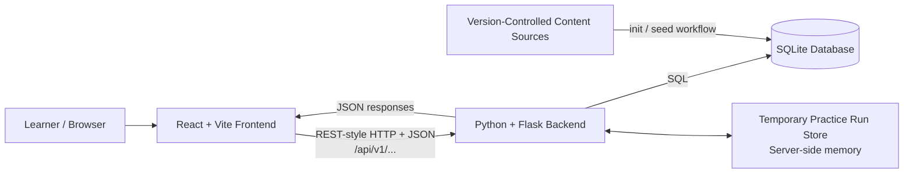

# French Learning Web Application
## System Architecture Specification

**Document status:** Baseline v1.0  
**Project type:** Web Application Development final project  
**Architecture style:** Local three-layer client-server web application  
**Frontend:** React + Vite  
**Backend:** Python + Flask  
**Database:** SQLite  
**Communication:** REST-style HTTP API + JSON  
**Deployment target:** Local development and local demonstration  

---

## 1. Purpose

This document defines the system-level architecture for the French Learning Web Application MVP.

It records the architectural decisions that govern how the React frontend, Flask backend, SQLite database, static content sources, and temporary Practice runtime state interact.

It is intended to be used as a shared implementation reference by all contributors, including AI-assisted coding workflows. Implementation should follow these boundaries unless the team explicitly approves an architecture change.

This document translates the frozen product requirements and technical direction into system-level architectural decisions. It defines the major components, responsibility boundaries, trust boundaries, persistence boundaries, and data flows that implementation must preserve.

---

## 2. Architectural Goals

The MVP architecture is intentionally simple.

It should:

- support the agreed learner-facing MVP without unnecessary infrastructure;
- keep frontend, backend, and persistence responsibilities clearly separated;
- provide one stable API boundary between React and Flask;
- keep business rules authoritative on the backend;
- use SQLite as the only persistent application database;
- keep static curriculum content maintainable through version-controlled source files;
- allow multiple contributors to work in parallel without redefining system ownership;
- remain easy to run, inspect, explain, and modify in a local project environment.

The architecture should **not** introduce production-scale infrastructure that is unnecessary for the current scope.

---

## 3. High-Level System Context



Runtime request path:

```text
Browser
  -> React frontend
  -> /api/v1/... HTTP request
  -> Flask backend
  -> SQLite query/update when persistent data is required
  -> Flask response
  -> React render/update
```

The React frontend must never access SQLite directly.

Flask is the application boundary between the browser and persistent data.

---

## 4. Architectural Layers and Responsibilities

## 4.1 React + Vite Frontend

The frontend is responsible for presentation, navigation, and temporary interaction state.

Primary responsibilities:

- render the public and authenticated user interface;
- manage client-side page routing;
- call the `/api/v1/...` backend API;
- render Grammar, Vocabulary, Conjugation, and reference content returned by the backend;
- render Markdown content where required;
- show the learner's selected support-language presentation;
- manage UI-only state such as expanded/collapsed sections, selected tabs, filters, and form inputs;
- keep current Practice answers in React state while a Practice run is in progress;
- format timestamps and derived display values for presentation;
- map returned learning-unit metadata to frontend routes;
- display backend validation and error states in learner-friendly form.

The frontend is **not** authoritative for:

- authenticated learner identity;
- password verification;
- persistent learner state;
- database writes;
- Practice correctness or trusted score calculation;
- Mixed Practice eligibility;
- progress truth;
- streak truth;
- completion timestamps;
- ownership checks;
- enforcement of core business rules.

Frontend validation may improve usability, but it must never replace backend validation.

---

## 4.2 Python + Flask Backend

Flask is the authoritative application and business-logic layer.

Primary responsibilities:

- expose the REST-style `/api/v1` API;
- authenticate learners and resolve the current learner from the Flask session;
- hash and verify passwords using the project's Flask/Werkzeug-compatible password utilities;
- validate incoming request payloads and identifiers;
- enforce learner ownership and authorization rules;
- select support-language-sensitive content;
- read and write SQLite data;
- enforce learner-state rules for Mark as Learned, Review Later, and Continue Learning;
- determine Mixed Practice eligibility from learned content;
- select Practice questions according to the agreed rules;
- validate Practice submissions;
- calculate authoritative Practice results;
- persist completed Practice summaries;
- derive Dashboard progress, Recent Practice, current streak, and longest streak values;
- derive Mixed Practice `content_covered` for the current result;
- prevent invalid or duplicate state transitions;
- return consistent JSON success and error responses;
- keep implementation details such as SQL errors, password hashes, secret keys, and stack traces out of API responses.

Business rules must remain centralized in Flask rather than being independently reimplemented by individual frontend features.

---

## 4.3 SQLite Database

SQLite is the persistent relational data store for the local MVP.

It stores:

- learner accounts and support-language preference;
- static Grammar, Vocabulary, and Conjugation content after seeding;
- French Alphabet & Accents reference content after seeding;
- learning-unit identities and hierarchy relationships;
- Practice questions and question items;
- learner completion / Review Later / Continue Learning state;
- completed Practice session summaries used by Basic Practice History and streak calculations.

Database responsibilities include:

- persistent storage;
- primary keys and foreign keys;
- uniqueness constraints;
- relational integrity;
- transaction boundaries for writes that must succeed or fail together.

SQLite does **not** own:

- browser rendering;
- HTTP routing;
- authentication decisions;
- localization selection;
- Practice session orchestration;
- learner-facing navigation;
- business rules that require application context beyond database constraints.

Cross-table application invariants that cannot be fully represented by simple SQLite constraints must be enforced by seed validation and Flask business logic.

---

## 4.4 Version-Controlled Static Content Sources

Static curriculum/reference content is authored outside the runtime database in version-controlled project files.

Conceptually:

```text
Static source files
    |
    | load + validate + transform
    v
seed.py
    |
    v
SQLite static content tables
```

The source files are the authoring source of truth for project-prepared learning content.

SQLite is the runtime query store used by the application after the content has been seeded.

This separation means contributors should not manually edit static curriculum content directly in the generated SQLite database as the normal content-authoring workflow.

Typical source groups include:

```text
backend/data/
├── grammar/
├── vocabulary/
├── conjugation/
├── reference/
└── questions/
```

The seed workflow is responsible for validating content before committing it to SQLite.

---

## 4.5 Temporary Practice Run Store

An in-progress Practice run is temporary runtime state and is separate from persistent `practice_sessions` history.

For the local MVP, Flask may keep Practice run metadata in a server-side in-memory store.

Conceptual temporary state:

```text
practice_run_id
user_id
practice_type
learning_unit_id (normal Practice only)
selected question IDs
submitted flag
```

This store exists only to support an active Practice interaction.

It is **not** a replacement for SQLite and must not be treated as durable learner history.

If the Flask process restarts, an unfinished in-memory Practice run may be lost. This is acceptable for the local MVP because incomplete Practice does not create Practice History or streak activity.

---

# 5. Communication Architecture

## 5.1 Frontend-Backend Protocol

React and Flask communicate using REST-style HTTP requests with JSON responses.

All API routes use the versioned base path:

```text
/api/v1
```

The frontend should communicate through the API rather than depending on backend Python modules, SQL queries, database table shapes, or SQLite files.

The API is the stable integration boundary between the frontend and backend.

---

## 5.2 Local Vite Proxy

During local development, frontend code should use relative API URLs:

```text
/api/v1/...
```

The Vite development proxy forwards those requests to Flask.

Frontend code must not hard-code a backend host/origin for normal project usage.

Conceptually:

```text
Browser
  |
  | request /api/v1/...
  v
Vite development server
  |
  | proxy API request
  v
Flask API
```

This keeps frontend API calls stable and preserves a simple same-origin development model from the browser's point of view.

---

## 5.3 JSON Contract Boundary

The frontend consumes API response models, not raw database rows.

For example:

```text
SQLite columns / joins
        |
        v
Flask query + business logic + localization
        |
        v
API response model
        |
        v
React UI
```

The backend may combine data from multiple tables before returning a response.

The Dashboard is a clear example: React receives one Dashboard-oriented response rather than being required to understand the underlying table structure.

Endpoint-specific payload shapes, status codes, and error details are outside the scope of this system-level architecture document. This document defines the communication boundary and ownership rules rather than individual endpoint contracts.

---

# 6. Authentication and Session Architecture

The MVP uses Flask session-cookie authentication rather than JWT.

Conceptually, the authenticated session identifies the learner as:

```python
session["user_id"]
```

The browser sends the session cookie with authenticated API requests. Flask resolves the current learner from that session.

Authentication flow:

```text
Register / Login form
        |
        v
React sends credentials to Flask
        |
        v
Flask validates input
        |
        +--> register: hash password and create user
        |
        +--> login: verify stored password hash
        |
        v
Flask establishes authenticated session
        |
        v
Browser keeps session cookie
        |
        v
Subsequent /me/... requests resolve current learner in Flask
```

Architectural rules:

- the frontend must never send a `user_id` as authority for learner-owned operations;
- learner-owned routes use the authenticated session as the identity source;
- passwords are never stored in plain text;
- the Flask `SECRET_KEY` must remain outside committed source code;
- session cookies should use `HttpOnly` and `SameSite=Lax` for the MVP;
- `Secure` is disabled only for local HTTP and should be enabled if the application is ever served through HTTPS;
- JWT, OAuth/social login, MFA, and email-verification infrastructure are outside the MVP.

---

# 7. Data Ownership and Sources of Truth

The system uses different sources of truth for different kinds of state.

| Concern | Authoritative source |
|---|---|
| Static authored curriculum/reference content | Version-controlled source files before seeding |
| Runtime static content queries | SQLite seeded content tables |
| Learner account and support language | `users` |
| Learned / Review Later / Continue Learning state | `user_learning_state` |
| Completed Practice History | `practice_sessions` |
| Current and longest streak inputs | `practice_sessions.activity_date` |
| In-progress Practice run metadata | Flask temporary runtime store |
| Current unsaved Practice answers | React interaction state until submission |
| Authentication identity | Flask session |
| API-visible derived values | Flask calculations over authoritative source data |

Derived values should not be stored redundantly when they can be calculated reliably.

Examples:

```text
progress
-> derived from learned state + total learning units

accuracy
-> correct_count / total_questions

Recent Practice Type
-> learning_units.unit_type or mixed

current / longest streak
-> completed Practice activity dates
```

---

# 8. Core Data Flows

## 8.1 Registration and Login Flow

```text
React form
   |
   | credentials JSON
   v
Flask Auth endpoint
   |
   | validate / normalize
   | hash or verify password
   v
SQLite users
   |
   v
Flask session created/refreshed
   |
   v
JSON response
   |
   v
React routes learner to setup or authenticated area
```

Only Flask accesses the password hash.

---

## 8.2 Learning Content Read Flow

```text
Learner opens a learning page
        |
        v
React calls content endpoint using stable slug
        |
        v
Flask authenticates request
        |
        v
Flask queries SQLite content hierarchy
        |
        v
Flask selects support-language-sensitive fields
        |
        v
JSON content response
        |
        v
React renders learning content
```

Stable slugs form the public content-navigation identity. Internal numeric database IDs must not become learner-facing URLs solely because they exist in SQLite.

---

## 8.3 Continue Learning / Learner State Flow

When a learner opens a learning unit:

```text
React learning page
   |
   | POST open action
   v
Flask
   |
   | resolve current user from session
   | resolve learning unit from slug
   | update last_opened_at
   v
SQLite user_learning_state
```

When the learner changes Mark as Learned or Review Later state:

```text
React state action
   |
   | PATCH learner-unit state
   v
Flask validation + business rules
   |
   v
SQLite user_learning_state
   |
   v
Updated state response
```

Mark as Learned affects progress only. Review Later is independent. Neither action creates streak activity.

---

## 8.4 Normal Practice Flow

```text
React requests Practice start
        |
        v
Flask loads seeded questions for learning unit
        |
        +--> SQLite questions / question_items
        |
        v
Flask creates temporary practice_run_id
        |
        +--> temporary server-side run state
        |
        v
React receives Practice question set
        |
        v
Learner interacts with Practice UI
        |
        +--> current unsaved answers remain interaction state
        |
        v
Practice submission/completion request
        |
        v
Flask validates run + ownership + submitted answers
        |
        v
Flask calculates authoritative result
        |
        +--> incomplete/invalid run: no history write
        |
        +--> valid completed run:
                 insert one practice_sessions row
        |
        v
Result JSON returned to React
```

Starting Practice does not create Practice History.

Persistent Practice History is created only after a valid completed Practice submission according to the API contract.

Detailed answer-feedback and scoring semantics remain defined by the Requirements and API Contract artifacts; this architecture document only establishes that Flask is authoritative for validation, scoring, and persistence.

---

## 8.5 Mixed Practice Flow

```text
React requests Mixed Practice
        |
        v
Flask resolves current learner
        |
        v
SQLite user_learning_state
        |
        | find learned units only
        v
SQLite questions
        |
        | apply optional module/question-type filters
        | choose eligible distinct questions
        v
Flask temporary Practice run
        |
        v
React Practice UI
        |
        v
Submission/completion
        |
        v
Flask validation + scoring
        |
        +--> derive content_covered from selected question IDs
        |
        +--> insert one mixed practice_sessions summary
        |
        v
Result JSON
```

The generated Mixed Practice composition is runtime state.

The full question composition is not persisted as Basic Practice History. Only the completed session summary required by the MVP is stored.

Optional Mixed Practice filters narrow the eligible learned-question pool; they do not create a new persistence subsystem.

Adaptive/personalized Mixed Practice is future scope and does not change the current architecture.

---

## 8.6 Dashboard Read Flow

```text
React Dashboard
      |
      | GET /api/v1/me/dashboard
      v
Flask aggregate read
      |
      +--> users
      +--> learning_units
      +--> user_learning_state
      +--> practice_sessions
      +--> module hierarchy tables as required
      |
      v
Backend derives:
- module progress
- Continue Learning
- current streak
- longest streak
- Recent Practice
      |
      v
Dashboard-oriented JSON
      |
      v
React presentation
```

React should not reproduce the backend's authoritative Dashboard business calculations from raw database-like data.

---

# 9. Persistent State vs Runtime State

The architecture deliberately separates durable data from temporary interaction state.

## 9.1 Persistent State

Persistent state belongs in SQLite when it must survive application/browser restarts.

Examples:

- learner account;
- support-language preference;
- learner completion state;
- Review Later state;
- `last_opened_at` for Continue Learning;
- completed Practice summaries;
- static seeded curriculum/reference content.

## 9.2 Runtime State

Runtime-only state should not be persisted merely because it exists during an interaction.

Examples:

- an unfinished Practice run;
- current unsaved answer selections;
- current page/tab state;
- Mixed Practice generated composition after the current result no longer needs it;
- open/closed navigation sections.

A feature should not create a new database table unless persistence is actually required by the approved scope.

---

# 10. Local Development Topology

The MVP runs locally and does not require public deployment.

Conceptual topology:

```text
Developer machine
|
├── Vite / React development frontend
|      |
|      └── relative /api/v1 requests
|              |
|              v
├── Flask application
|      |
|      ├── API routes
|      ├── auth/session logic
|      ├── business rules
|      ├── temporary Practice run state
|      └── database access
|              |
|              v
├── SQLite database file
|
└── version-controlled static content sources
       |
       └── init/seed scripts -> SQLite
```

Typical data setup responsibilities are separated conceptually:

```text
init_db.py
-> create database schema

seed.py
-> validate and populate static project content

Flask runtime
-> create/update learner-generated state
```

The generated SQLite database is runtime data, not the authoritative authoring location for static curriculum files.

---

# 11. Trust and Security Boundaries

The browser is an untrusted client from the backend's perspective.

Therefore Flask must validate all security-sensitive and business-sensitive input regardless of frontend behavior.

Backend trust rules include:

- never trust frontend-supplied learner identity;
- never trust client-calculated score or accuracy;
- never trust client-calculated streak values;
- derive completion timestamps and activity dates on the backend;
- verify that requested learning units and question/item IDs are valid;
- verify Practice-run ownership before accepting submission;
- prevent one Practice run from creating duplicate completed history rows;
- keep password hashes and secret configuration out of responses;
- return safe error messages without exposing stack traces or SQL internals;
- enforce database foreign-key relationships and application-level invariants.

Frontend validation is convenience validation. Backend validation is authoritative validation.

---

# 12. Architectural Non-Goals

The MVP architecture intentionally does not include:

- microservices;
- managed/cloud databases;
- Redis or distributed caching;
- message queues;
- distributed systems;
- separate authentication services;
- JWT authentication;
- OAuth/social-login infrastructure;
- email-verification services;
- password-reset email infrastructure;
- cloud hosting;
- production load balancing;
- native mobile backends;
- offline/PWA synchronization architecture;
- learner analytics pipelines;
- AI tutor services;
- adaptive recommendation infrastructure.

These components should not be introduced merely because they are common in larger production systems.

They require an explicit scope and architecture change if ever added later.

---

# 13. Implementation Guardrails for Contributors and AI-Assisted Coding

All contributors should preserve the following architectural decisions:

1. **React communicates with Flask through `/api/v1`; React does not access SQLite directly.**
2. **Flask is authoritative for authentication, validation, scoring, persistence, and business-rule enforcement.**
3. **Learner identity comes from the Flask session, never from a frontend-provided `user_id`.**
4. **Frontend state is not persistent truth.** Persist required learner state through Flask into SQLite.
5. **SQLite is the only persistent application database for the MVP.**
6. **Static curriculum/reference content is authored in version-controlled source files and seeded into SQLite.**
7. **Use relative `/api/v1/...` frontend requests through the Vite proxy; do not hard-code backend origins in application code.**
8. **Do not duplicate backend business logic in React and treat the duplicate as authoritative.**
9. **Do not expose raw database schema as the frontend contract.** Flask should return API-oriented response models.
10. **Do not persist temporary UI state simply because it exists during a session.**
11. **Temporary Practice runs may use server-side memory for the local MVP and are distinct from persistent `practice_sessions`.**
12. **Completed Practice history, progress, and streak-related state must survive normal browser/application use through SQLite persistence.**
13. **Do not introduce JWT, Redis, microservices, cloud infrastructure, or other production-scale components without an explicit architecture change.**
14. **Do not add new persistence structures for Future/Stretch features unless that feature is explicitly selected for implementation.**
15. **When implementation conflicts with the frozen requirements or this architecture baseline, resolve the design inconsistency before allowing separate code paths to become competing sources of truth.**

---

# 14. Baseline Architecture Summary

The frozen MVP architecture is:

```text
                 Learner Browser
                       |
                       v
               React + Vite Frontend
                       |
                       | REST-style HTTP + JSON
                       | /api/v1/...
                       v
                 Flask Backend
                 /      |      \
                /       |       \
       auth/business    |        temporary Practice
          logic         |        run state (memory)
                        |
                        | SQL
                        v
                  SQLite Database
                        ^
                        |
              validated seed/import
                        |
         Version-Controlled Content Files
```

Responsibility boundary:

```text
React
-> presentation, routing, interaction state, API consumption

Flask
-> authentication, validation, business rules, scoring,
   localization selection, persistence orchestration, API responses

SQLite
-> durable relational application data and integrity constraints

Source content files
-> maintainable authoring source for static curriculum/reference data

Temporary Practice store
-> short-lived in-progress Practice metadata only
```

This architecture is intentionally sufficient for the agreed local MVP and should be treated as the system-level baseline for implementation.
